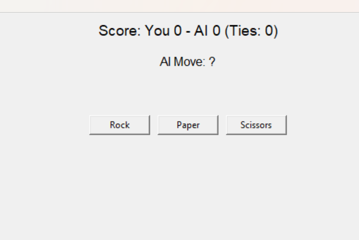

# Rock Paper Scissors & RPSLS - GUI 🎮✊✋✌️🦎🖖

This project showcases my skills in Python, GUI development, and game logic. It’s designed as a beginner-friendly game but also demonstrates how I can extend functionality (e.g., RPS ➝ RPSLS).
---

## 🖥️ Features
- 🎨 Graphical User Interface using tkinter
- 🤖 AI opponent (randomized choice)
- 📊 Live score tracking (Player, AI, and Ties)
- 🏆 Reset button to start fresh
- 🔄 Play both **classic RPS** and the extended **RPSLS** version
- 🔥 Beginner-friendly project

## 📸 Screenshot

## 🚀 How to Run
1. Clone this repo:
   git clone https://github.com/shaina-bit/Rock-Paper-Scissor-Game/blob/main/advanced_rps_game.py
   cd advanced rps game
2. Run the game (classic RPS):
   python rps_gui.py
3. Run the game (RPSLS version):
   python rpsls_gui.py
(note: change the ruleset_key = "RPS" to ruleset_key = "RPSLS")

⚙️ Requirements:
    -Python 3.x
    -Tkinter (comes pre-installed with Python)
    
 🛠️ Future Improvements:
    -Add sound effects 🎶
    -Better GUI design 🎨
    -Game history 📜
    -Multiplayer mode 🧑‍🤝‍🧑
    -Smarter AI opponent 🤖

 📚 Learning Goals:
     -This project helped me practice:
     -Python basics
     -Game logic (if/else conditions, dictionaries)
     -Tkinter GUI development
     -Updating GUI elements dynamically
     -Extending game rules (RPS ➝ RPSLS) 

  🤝 Contributing:
     Pull requests are welcome! If you’d like to add new features or improve the design, feel free to fork and submit a PR.   

  📄 License:
     This project is open source and available under the MIT License.
   
